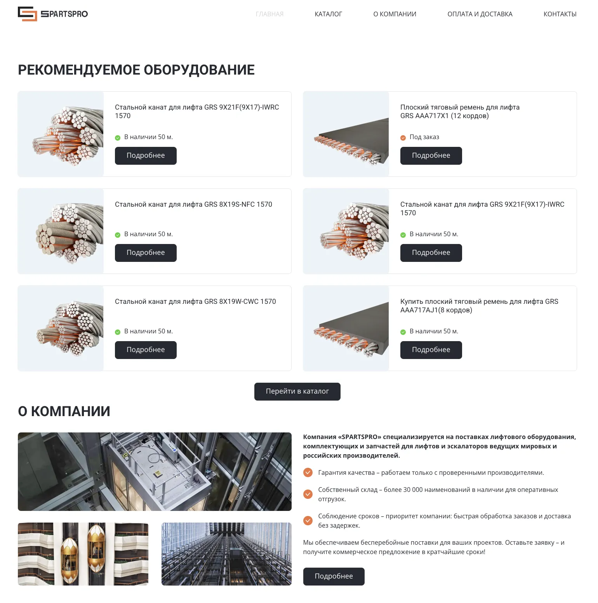

# SpartsPro

Тестовое задание, включающее реализацию адаптивной вёрстки главной страницы сайта.

## Демо

🟢 **Live:** [https://sparts-pro.web.app/](https://sparts-pro.web.app/)



## 🚀 Особенности

- Адаптивная вёрстка под различные устройства.
- Оптимизированный процесс сборки на Webpack.
- Optimized build process with Webpack.
- PostCSS с Autoprefixer и Preset-Env для кросс-браузерной поддержки CSS.
- Настроен деплой на Firebase Hosting.

## 🛠️ Используемые технологии

- **Логика:** TypeScript
- **Стили:** Sass/SCSS, PostCSS, Autoprefixer
- **Сборка:** Webpack
- **Деплой:** Firebase Hosting

## Запуск

- **Запуск дев-сервера:** Локальный запуск проекта в режиме разработки:
  ```bash
  npm run start
  ```
- **Сборка продакшн-версии:** создание оптимизированной сборки в папке `dist`:
  ```bash
  npm run build
  ```
- **Сборка в режиме разработки:** проект без продакшн-оптимизаций:
  ```bash
  npm run build:dev
  ```
